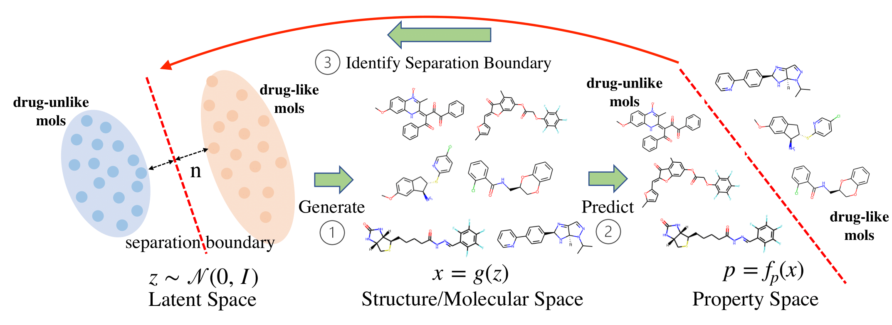

# ChemSpacE: Interpretable and Interactive Chemical Space Exploration

Official implementation of **ChemSpacE**, an efficient and effective approach to explore chemical space via aligning the latent space of molecular generative models, by Yuanqi Du, Xian Liu, Nilay Mahesh Shah, Shengchao Liu, Jieyu Zhang, Bolei Zhou.

[TMLR paper link](https://openreview.net/forum?id=C1Xl8dYCBn)



## Setup and Installation

### Environment Setup
Anaconda is recommended for managing the enviroment for this project. 
Create an environment for this project with:
```
conda env create -f environment.yml
```

*Note: Examples are provided for the ZINC dataset. Files and parameters can be substituted to work with the qm9 dataset.* 

### Data Preprocessing

Generate molecular graphs from SMILES strings:
```
cd data
python data_preprocess.py --data_name zinc250k
```

### Download Trained Models
```
https://bit.ly/chemspace-models
```
Trained MoFlow models were obtained from https://github.com/calvin-zcx/moflow. 


## ChemSpacE Method

### Randomly Generate Molecules 
```
python chemspace.py --data_name zinc250k --random
```

### Train SVM to Find Directions
```
python train_boundary_zinc.py
```

### Traverse Learned Directions (Molecule Manipulation)
#### Single Property
```
python chemspace.py --data_name zinc250k --traverse
```
#### Multi-Property
```
python chemspace.py --data_name zinc250k --multi_property --traverse
```

### Calculate Success Rate of Molecule Manipulation
#### Single Property
```
python calculate_statistics_single_prop.py --mani_range 1
```
#### Multi-Property
```
python calculate_statistics_multi_prop.py --mani_range 1
```

### Molecule Optimization
#### Single Property
```
python optimize_property_chemspace.py --data_name zinc250k --property_name gsk3b --save_path gsk3b_0.6_range30 --topscore
```
#### Multi-Property
```
python optimize_property_chemspace.py --data_name zinc250k --property_name qed_plogp --save_path qed_plogp_0.6_range30 --multi_property --topscore
```

### Contrained Molecule Optimization (enforce similarity to reference molecule)
#### Single Property
```
python optimize_property_chemspace.py --data_name zinc250k --path_range 30 --sim_cutoff 0.6 --property_name gsk3b --save_path gsk3b_0.6_range30 --consopt
```
#### Multi-Property
```
python optimize_property_chemspace.py --data_name zinc250k --path_range 30 --sim_cutoff 0.6 --property_name qed_plogp --save_path qed_plogp_0.6_range30 --multi_property --consopt
```

## Cite us
```
@article{
  du2023chemspace,
  title={ChemSpacE: Interpretable and Interactive Chemical Space Exploration},
  author={Yuanqi Du and Xian Liu and Nilay Mahesh Shah and Shengchao Liu and Jieyu Zhang and Bolei Zhou},
  journal={Transactions on Machine Learning Research},
  issn={2835-8856},
  year={2023},
  url={https://openreview.net/forum?id=C1Xl8dYCBn},
  note={}
}
```
